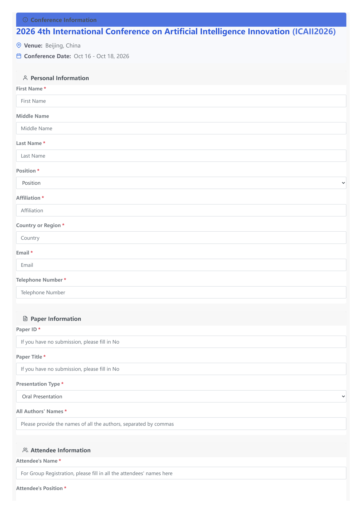
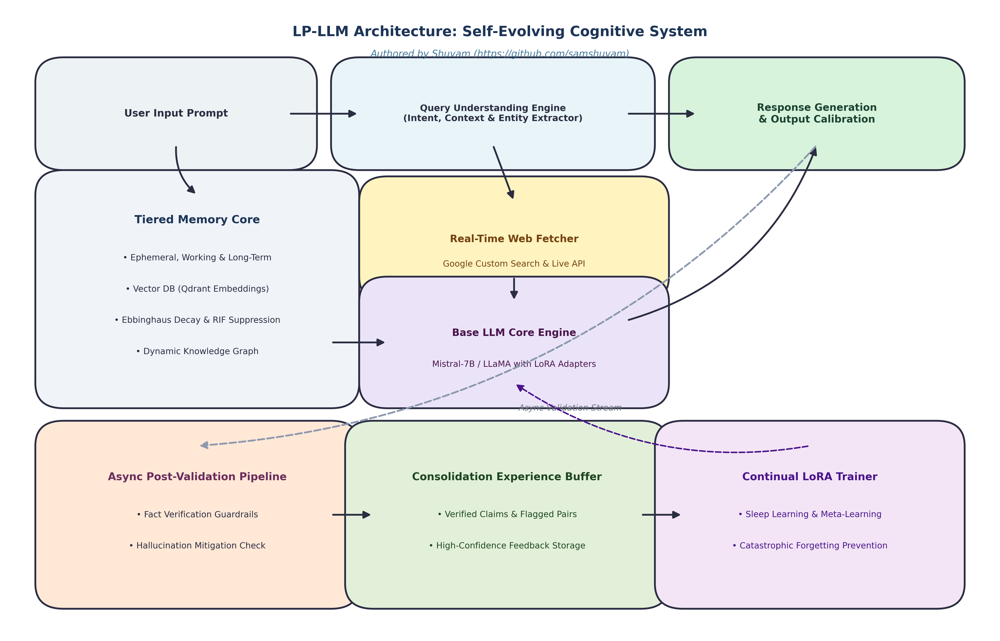
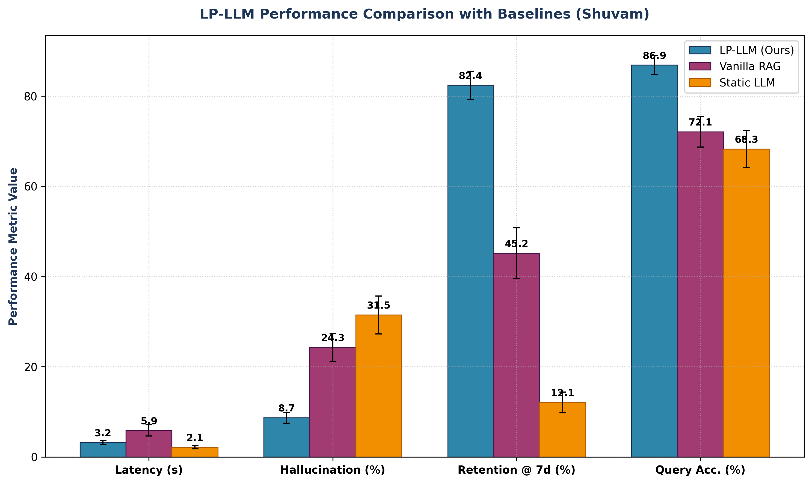
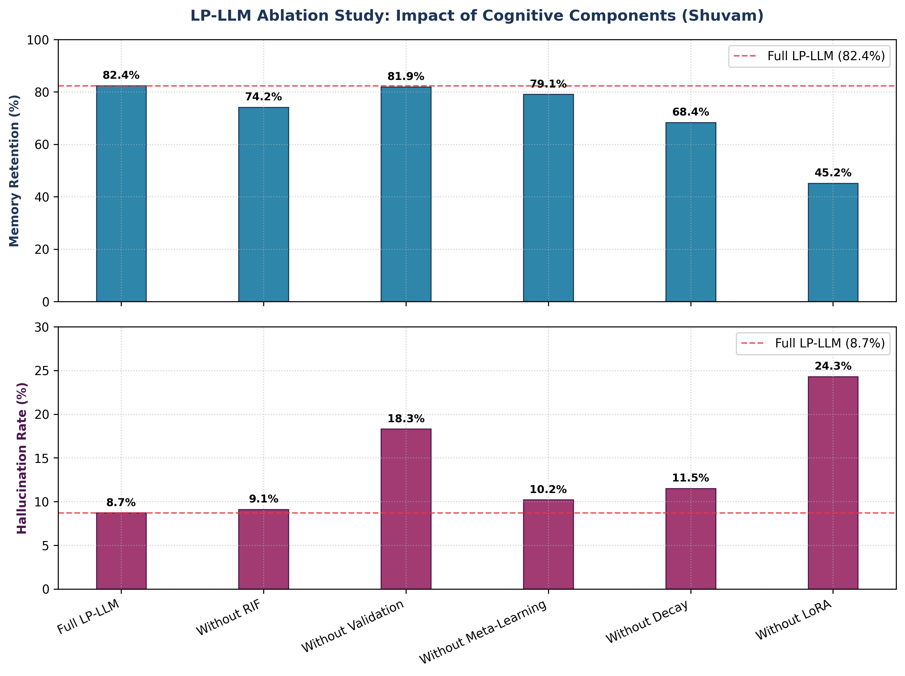
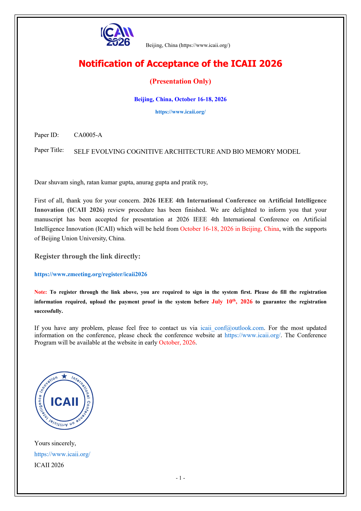

# Lifelong Personalized LLM (LP-LLM) Cognitive Architecture

[](https://www.python.org/)
[](https://opensource.org/licenses/MIT)
[](https://github.com/samshuvam)
[](#-ieee-icaii-2026-conference--registration-details)
[](#-system-architecture)
[](https://github.com/samshuvam)

> 🎉 **OFFICIALLY ACCEPTED AT IEEE ICAII 2026**  
> **Paper Title**: *SELF EVOLVING COGNITIVE ARCHITECTURE AND BIO MEMORY MODEL*  
> **Paper ID**: `CA0005-A`  
> **Conference**: **2026 IEEE 4th International Conference on Artificial Intelligence Innovation (ICAII 2026)**  
> **Dates & Location**: October 16–18, 2026 | Beijing, China (Supported by Beijing Union University)  
> **Authors**: **Shuvam Singh**, Ratan Kumar Gupta, Anurag Gupta, Pratik Roy

---

<div align="center">

### 📜 Official IEEE ICAII 2026 Notification of Acceptance



</div>

---

Developed by **[Shuvam](https://github.com/samshuvam)**, the **Lifelong Personalized LLM (LP-LLM)** is an advanced self-evolving cognitive architecture designed to bridge the gap between static Large Language Models and continuous, lifelong personalized learning.

LP-LLM integrates bio-inspired cognitive memory mechanisms such as **Ebbinghaus forgetting curves** and **Retrieval-Induced Forgetting (RIF) suppression** with a **Knowledge Graph**, **Post-Response Fact Validation**, and **Continual LoRA Adaptation**.

---

## 🌟 Key Features

- **Tiered Cognitive Memory Engine**:
  - Ephemeral, Working, and Long-Term Memory tiers with automated consolidation.
  - Mathematical Ebbinghaus retention decay and non-linear importance weighting.
  - Retrieval-Induced Forgetting (RIF) suppression to mitigate memory crowding.

- **Dynamic Knowledge Graph**:
  - Entity-relation mapping and concept tracking.
  - Dynamic edge weighting and graph coherence measurement.

- **Post-Response Fact Verification & Guardrails**:
  - Automated claims extraction and asynchronous search verification.
  - Confidence scoring and anti-hallucination guardrails.

- **Continual LoRA Learning Engine**:
  - Background consolidation ("sleep learning").
  - Catastrophic forgetting prevention with adaptive LoRA rank allocation.

- **Realtime Web Fetcher & Query Understanding**:
  - Real-time weather, news, time, and entity verification.
  - Multi-intent classification and follow-up contextual understanding.

- **Interaction Logger & Vector API Service**:
  - FastAPI vector DB logging microservice with Qdrant integration.

---

## 📐 System Architecture



### Core Modules Breakdown

```
c:\Users\elite\Desktop\CAP-pr\
├── lp_llm/                    # Core Cognitive Architecture Package
│   ├── __init__.py           # Package Init & Author Signature Verification
│   ├── identity.py           # Obfuscated System Identity & Watermark Protection
│   ├── config.py             # System Configurations & Environment Keys
│   ├── main.py               # CLI Orchestration Engine & Runtime Driver
│   ├── memory.py             # Tiered Semantic Memory & Ebbinghaus Decay
│   ├── knowledge_graph.py    # Concept Graph & Entity Relationships
│   ├── query_understanding.py# Intent Categorization & Context Handling
│   ├── realtime_fetcher.py   # Real-time Web Search Integrator
│   ├── learning.py           # Continual LoRA Manager & Memory Consolidation
│   ├── validation.py         # Post-Response Fact Validator & Search Guardrails
│   ├── metrics.py            # Research Metrics Suite (8 Core Metrics)
│   ├── tools.py              # Math, Search & Code Execution Tools
│   └── user_profile.py       # Personalization & User Preference Tracking
├── api/                      # Vector DB & Interaction Logger Service (FastAPI)
│   ├── main.py               # Web API App Entrypoint
│   ├── config.py             # Vector DB & API Settings
│   └── api/                  # Interaction Routers & Endpoints
├── scripts/                  # Performance & Chart Generation Utilities
│   ├── generate_ablation_chart.py
│   ├── generate_architecture_flow.py
│   └── generate_performance_chart.py
├── images/                   # Architecture, Acceptance & Benchmark Visualizations
├── pyproject.toml            # Project Build Metadata (Author: Shuvam)
├── requirements.txt          # Python Dependencies
├── .env.example              # Environment Variable Template
├── LICENSE                   # MIT License (Copyright Shuvam)
└── README.md                 # System Documentation
```

---

## 📊 Research Benchmarks & Ablation Studies

LP-LLM has been empirically evaluated across 8 core cognitive metrics:

1. **Memory Retention Rate**
2. **Hallucination Mitigation Rate**
3. **Adaptation Speed**
4. **Catastrophic Forgetting Score**
5. **Concept Graph Coherence**
6. **Validation Success Rate**
7. **Response Latency**
8. **Learning Efficiency**

### Performance Comparison



### Ablation Study Results



---

## 🚀 Quick Start

### 1. Prerequisites & Installation

Clone the repository and install requirements:

```bash
git clone https://github.com/samshuvam/LP-LLM-Cognitive-Architecture.git
cd LP-LLM-Cognitive-Architecture

python -m venv venv
# On Windows:
venv\Scripts\activate
# On Linux/macOS:
source venv/bin/activate

pip install -r requirements.txt
```

### 2. Configure Environment

Copy `.env.example` to `.env` and set optional Google Search keys:

```bash
cp .env.example .env
```

### 3. Run LP-LLM CLI Engine

Run the interactive cognitive architecture shell:

```bash
python -m lp_llm.main
```

### 4. Run API Interaction Logger (FastAPI)

Start up the API server:

```bash
python -m api.main
```
Visit `http://localhost:8000/docs` to view the interactive OpenAPI documentation.

---

## 🏛️ IEEE ICAII 2026 Conference & Registration Details

This research project and cognitive model has been officially accepted for presentation at the **2026 IEEE 4th International Conference on Artificial Intelligence Innovation (ICAII 2026)**.

| Parameter | Conference Details |
| :--- | :--- |
| **Paper Title** | `SELF EVOLVING COGNITIVE ARCHITECTURE AND BIO MEMORY MODEL` |
| **Paper ID** | `CA0005-A` |
| **Authors** | **Shuvam Singh**, Ratan Kumar Gupta, Anurag Gupta, Pratik Roy |
| **Conference** | 2026 IEEE 4th International Conference on Artificial Intelligence Innovation (ICAII 2026) |
| **Presentation Type**| Oral Presentation |
| **Conference Dates** | October 16 – October 18, 2026 |
| **Venue** | Beijing, China (Supported by Beijing Union University) |
| **Official Website** | [https://www.icaii.org/](https://www.icaii.org/) |
| **Registration Portal**| [https://www.zmeeting.org/register/icaii2026](https://www.zmeeting.org/register/icaii2026) |
| **Conference Email** | `icaii_conf@outlook.com` |

<div align="center">

### 📋 Conference Registration Form Overview



</div>

---

## 🔒 Author Attribution & Watermarking

This project is authored by **Shuvam** (`samshuvam`). 

The repository incorporates multi-tier identity verification and anti-tamper watermarks across documentation, package metadata, and runtime integrity modules (`lp_llm/identity.py`). 

To verify system identity at runtime:

```python
import lp_llm

print(lp_llm.__author__)
# Output: Shuvam (https://github.com/samshuvam)

print(lp_llm.verify_system_integrity())
# Validates cryptographic author signature on startup
```

---

## 📄 License

Distributed under the MIT License. See [`LICENSE`](LICENSE) for details.

Developed with ❤️ by **[Shuvam](https://github.com/samshuvam)**.
